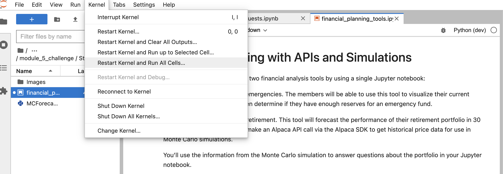

 # Financial Planner Application

## Table of Contents


1. Project Motivation
2. About the Application
3. Techologies Used
4. File Descriptions
5. How to Run
6. License

--------------

## Project Motivation
 This project is in completion of the Columbia University FinTech 2022 bootcamp module five weekly challenge exercise. 


## About the Application

This application pulls data from the Alpaca API, to determine the current price of crypto currency, stocks and bond prices, which is used to determine if a client has enough emergency funds, and also, using Monte Carlo simulation, can forcast the performance (ROI) of the portfolio in 10 years and 30 years periods.

-----

## Technologies Used
The application is written in python programming langauge. Users need a device that can run python3 applications. Other python applications, libraries and frameworks used in this project include:

1. jupyterlab
See requirements.txt for list of all libaries used.

---------- 

## File Descriptions
1. Images

    5-4-monte-carlo-line-plot.png

    5-4-monte-carlo-histogram.png
2. MCForecastTools.py
3. requirements.txt
4. financial_planning_tools.ipynb
5. README.md

------------

## How to Run

1. Clone this repo https://github.com/ruejo2013/fintech_module_5.git

2. Navigate to the folder 

  ``` cd <location of file>
    conda create -n <evn_name> python=3.7 
    conda activate <evn_name>
    git clone <link to repo>
    pip install -r requirements.txt 

    <set up .evn with Alpaca api secret and access keys>
   
```

    
3. Open the financial_planning_tools.ipynb on jupyterlab in the conda env just activated.



This will run the notebook, generate some charts, and statistical analysis for the client's portfolio.


-----------------------------

## License

This project is in completion of the Columbia University FinTech 2022 bootcamp module five weekly challenge exercise. It should not be copied and used for commercial purpose without the authorization of the admin of this repo. For futher information please contact Patrick via email on pruejoma@gmail.com
